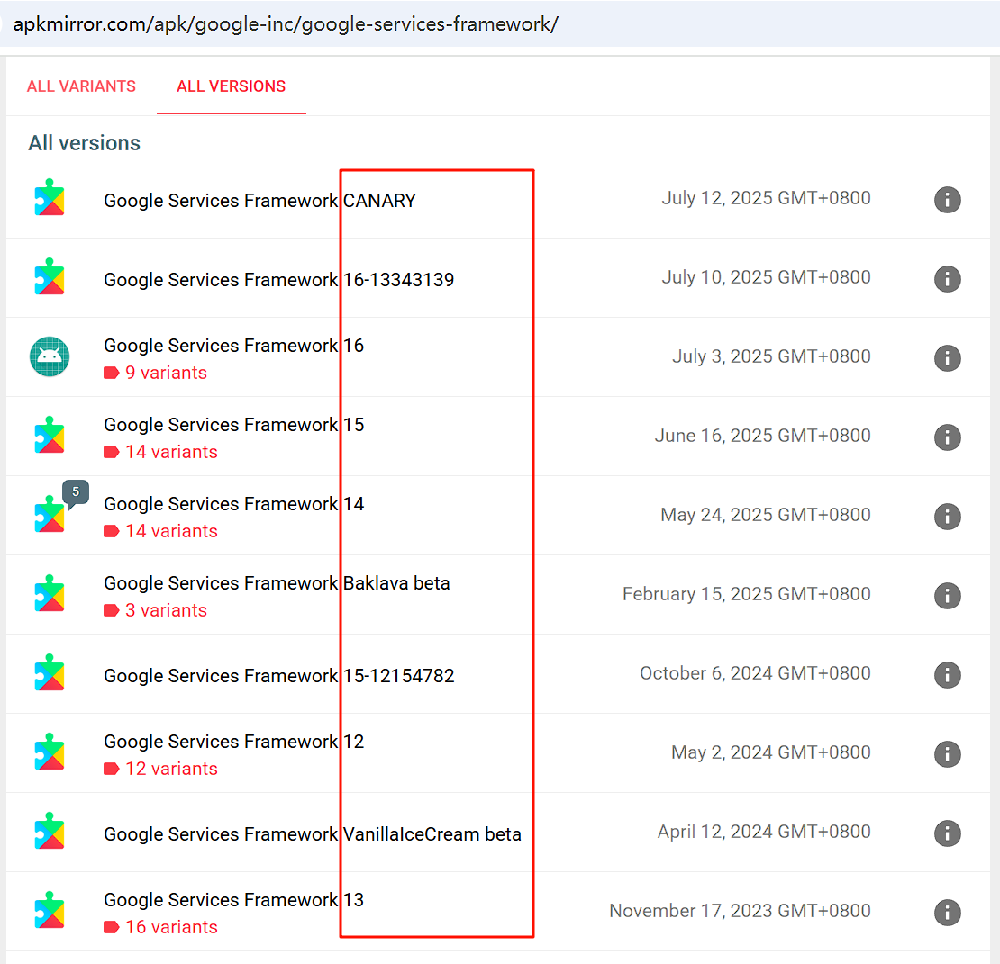
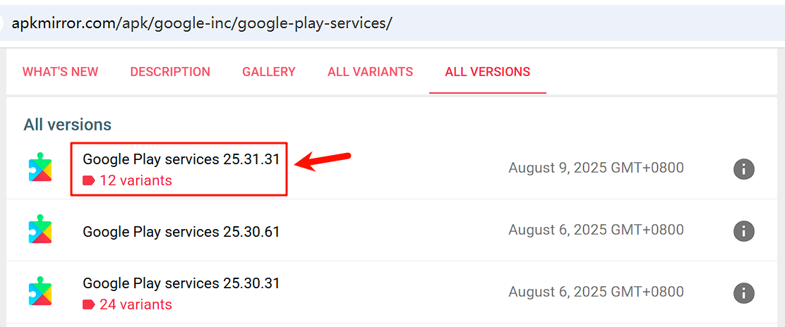

# 如何安装谷歌三件套

1. Google 服务框架（Google Services Framework）
2. Google Play 服务（Google Play services）
3. Google Play 商店（Google Play Store）

## 1. Google 服务框架

[Google 服务框架下载地址](https://www.apkmirror.com/apk/google-inc/google-services-framework/)

注意一定要选择你的**安卓系统版本**的服务框架，根据文件名字来找：

点击链接打开，找到最新的：

点击链接打开，再点击下载：

## 2. Google Play 服务

[Google Play 服务下载地址](https://www.apkmirror.com/apk/google-inc/google-play-services/)

在 **ALL VERSIONS** 里面选择第一个最新版本：

点击链接打开，在 **DOWNLOAD** 选择最接近系统版本，并且架构和屏幕 DPI 都符合的 APK：

点击链接打开，再点击下载：

## 3. Google Play 商店

[Google Play 商店下载地址](https://www.apkmirror.com/apk/google-inc/google-play-store/)

在 **ALL VERSIONS** 里面选择第一个最新版本：

点击链接打开，在 **DOWNLOAD** 选择最接近系统版本的 APK：

点击链接打开，再点击下载：

